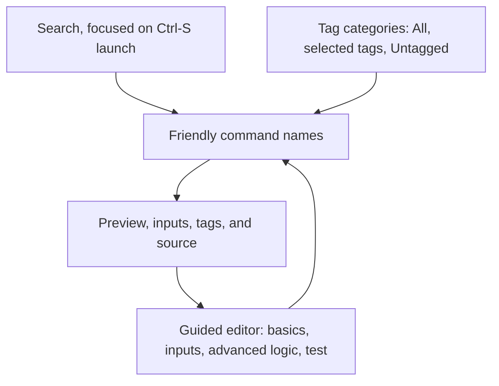
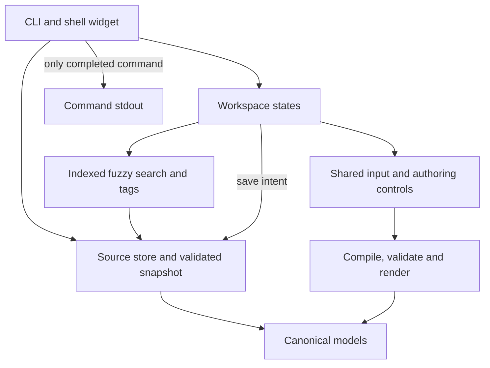
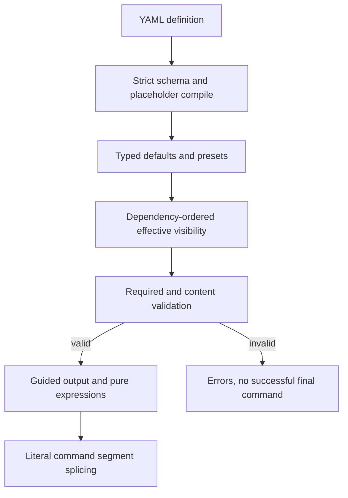
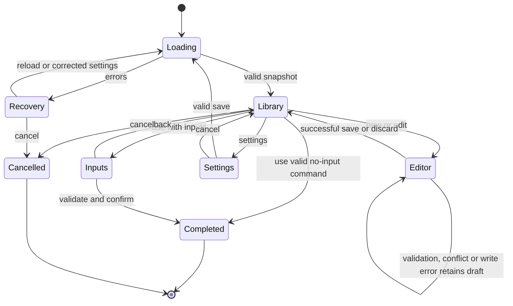
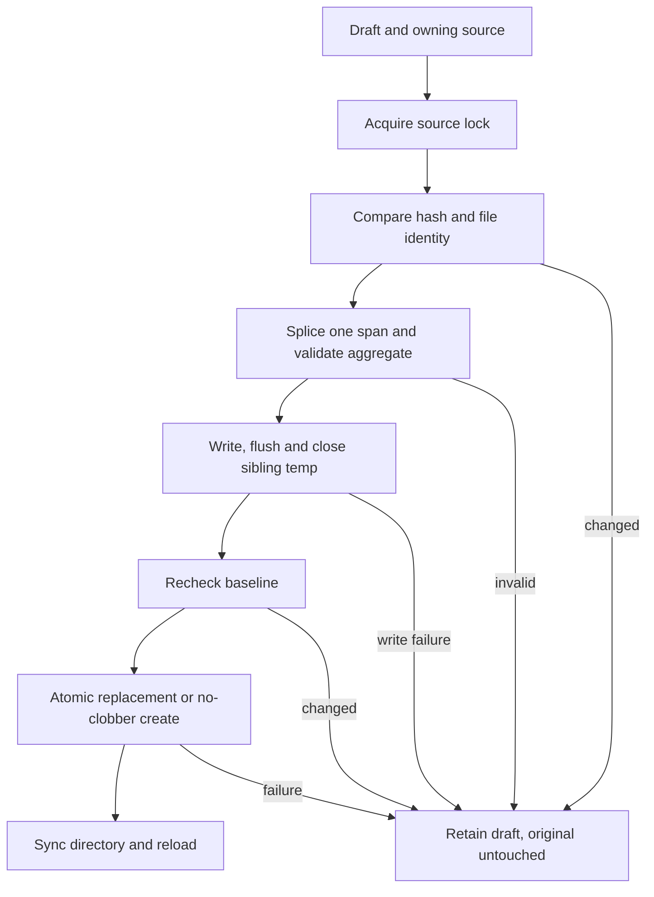

# Command Library Refresh - Plan

## Goal Capsule

- **Objective:** Make command snippets easy to find, organize, create, and edit without remembering template syntax.
- **Means:** A tag-driven terminal library workspace, guided authoring, and a smaller human-readable configuration model (KTD1-KTD8).
- **Product authority:** The confirmed scope and session-settled decisions in the Product Contract govern behavior; the Planning Contract governs engineering choices within it.
- **Execution profile:** Code implementation, with contract tests before replacing rendering and persistence paths; one coordinated change rather than a compatibility rollout.
- **Completion ownership:** The parent-owned pipeline coordinates implementation, simplification, independent review, eligible fixes, and an open PR with bounded CI observation. This plan does not authorize merge or release.
- **Stop conditions:** Stop for an infeasible settled choice, evidence of data-loss risk, or a failed required verification gate; do not trade away an R-ID to finish.

---

## Product Contract

### Summary

Refresh CS as a categorized command library with friendly names, fast search, previews, and guided creation and editing.
Keep the Ctrl-S workflow for filling inputs and returning a command to the shell.
Support hand-edited YAML and simple input behaviors, with an advanced expression mechanism for unusual commands.

### Problem Frame

The primary user usually adds snippets directly to YAML rather than through the current creation interface.
They forget the template syntax between additions, making creation and editing the largest source of friction.
The current fzf finder searches quickly but provides too little context and organization.
The subsequent variable-entry form works well and is not the main problem.

The locally reviewed pod-sorting snippet illustrates the authoring burden: namespace selection and a CPU/memory choice require separate computed blocks to produce flags and column numbers.
Visible names such as `kubectl-top-pods-with-sort` also force backend-style identifiers into the browsing experience.

### Key Decisions

- **Library workspace over a minimal finder.** Categorization matters more than minimizing the number of panes. Governs R1-R5. (session-settled: user-directed — chosen over search-first editor A and minimal wizard B: the user preferred C because it emphasizes categorization.)
- **Tags are categories.** Avoid maintaining two organization systems. Governs R3. (session-settled: user-directed — chosen over separate groups plus tags: one organization model avoids another field to maintain.)
- **Friendly names separate from identity.** Backend identifiers should not dictate what people read or search. Governs R6-R8. (session-settled: user-directed — chosen over visible slug-style names: the user dislikes names such as `kubectl-top-pods-with-sort`.)
- **Simple behaviors with an advanced escape hatch.** Routine snippets should not require expressions. Governs R10-R13. (session-settled: user-directed — chosen over expression-first and simple-only templates: easy common cases retain flexibility for unusual commands.)
- **Clean break.** The redesign need not carry obsolete contracts. Governs R21. (session-settled: user-directed — chosen over backward compatibility and explicit migration tooling: configuration and commands can be redesigned freely.)
- **YAML remains first-class.** Guided editing is another way to author the same library, not a replacement for editable files. Governs R14-R19. (session-settled: user-approved — chosen over a TUI-only workflow: the confirmed scope preserves manual YAML editing and source ownership.)

### Requirements

**Library and discovery**

- R1. Provide a built-in keyboard-operated library workspace with categories, a command list, and a selected-command detail area; external fzf is no longer required.
- R2. Ctrl-S invocation opens the workspace with search focused so typing starts a search immediately.
- R3. Derive sidebar categories from snippet tags, with All commands and Untagged views; selecting multiple tags matches snippets carrying every selected tag.
- R4. Search friendly names, descriptions, tags, and command text using fast fuzzy matching, combined with the active tag filters.
- R5. Show the selected command's description, tags, template preview, input summary, and source; preserve search and filters when returning from editing or input entry.

**Names and identity**

- R6. Use a friendly, searchable display name that accepts spaces and punctuation without requiring a slug.
- R7. Give snippets generated stable internal IDs, assigned on creation or explicit save, that remain unchanged when names, tags, or commands change; users must not invent IDs to author a snippet.
- R8. Hide IDs during normal browsing and permit duplicate display names; reject duplicate persisted IDs with source-aware diagnostics rather than silently overwriting entries.

**Guided authoring and template behavior**

- R9. Provide creation and editing inside the workspace, including a command editor, input configuration, contextual help, and a live test preview.
- R10. Let users paste a command and mark its varying parts as inputs, with existing placeholders detected when editing a template.
- R11. Offer declarative text inputs, optional value-bearing flags, boolean flags, choices with label-to-output mappings, and repeated flags; defaults, required inputs, and validation must not require custom expressions.
- R12. Support guided special-case output and conditional visibility/requiredness; hidden inputs must neither block validation nor contribute command arguments.
- R13. Provide one documented advanced expression mechanism for cases outside those behaviors, with validation and test preview; do not retain competing legacy transformation systems.

**Configuration and persistence**

- R14. Use one human-readable YAML model shared by manual editing and the TUI; description, tags, and advanced settings are optional for a basic snippet.
- R15. Remove repeated identity fields, unused metadata, and ineffective settings from the canonical configuration; each remaining field must have a distinct purpose.
- R16. Offer a settings/source-management screen for supported application configuration, using the same config file rather than separate TUI-only state.
- R17. Preserve user-library and project-local sources, show where each snippet resides, and let creation choose a writable destination.
- R18. Save an edit to its original source without flattening merged libraries into the main configuration or changing unrelated snippets and comments.
- R19. Validate before saving and protect the existing file from invalid input, failed writes, or unnoticed external changes; loading files must not modify them.

**Use and transition**

- R20. Preserve Ctrl-S → search or browse → fill inputs with live preview → insert the rendered command into the shell; cancellation emits no command, UI/diagnostics do not contaminate command stdout, and this flow never executes automatically.
- R21. Ship refreshed examples and documentation in the new format without backward-compatibility layers or migration tooling; do not automatically rewrite the user's installed library.
- R22. Validate the same input and template rules in preview, interactive use, and any retained noninteractive rendering path; invalid values cannot produce a successful final command.
- R23. Keep the workspace usable in narrow or resized terminals and in empty, no-match, or invalid-configuration states, with clear recovery and cancellation rather than clipping essential controls or crashing.

The workspace composition is directional; exact pane widths, shortcuts, and responsive transitions belong to implementation planning.



### Key Flows

- F1. Find and use a command.
  - **Trigger:** The user presses Ctrl-S.
  - **Steps:** Focus search, optionally narrow by tags, inspect a result, fill its inputs, and confirm the rendered command.
  - **Outcome:** The command is inserted into the shell without execution; cancelling leaves the shell input unchanged.
  - **Covers R1-R5, R20, R22-R23.**

- F2. Add a command without remembering template syntax.
  - **Trigger:** The user chooses New in the workspace.
  - **Steps:** Enter a friendly name, paste a command, mark inputs, configure their behaviors with help, choose tags and a destination, test representative values, and save.
  - **Outcome:** The command appears in its tag categories and search results with an assigned ID; the workspace remains open.
  - **Covers R6-R14, R17, R19.**

- F3. Edit a command safely.
  - **Trigger:** The user chooses Edit on a result.
  - **Steps:** Change the command, name, tags, or inputs; inspect the live test preview; validate and save.
  - **Outcome:** The existing identity and owning source are retained, and the previous search/filter context is restored; cancelling discards unsaved changes.
  - **Covers R5, R7, R9-R13, R18-R19.**

- F4. Maintain configuration through either interface.
  - **Trigger:** The user opens settings/source management or edits YAML externally.
  - **Steps:** Change supported settings or sources and validate the resulting configuration.
  - **Outcome:** The TUI and file describe the same library; invalid or conflicting content is reported without overwriting valid files.
  - **Covers R14-R19, R23.**

### Acceptance Examples

- AE1. Browse intersecting categories. **Covers R3-R5.**
  - **Given:** One snippet has Kubernetes and Monitoring tags, another has only Kubernetes, and another is untagged.
  - **When:** The user selects Kubernetes and Monitoring.
  - **Then:** Only the first snippet matches; clearing filters shows all snippets, and Untagged shows the third.

- AE2. Friendly names do not change identity. **Covers R6-R8.**
  - **Given:** A saved snippet is named “Pod resource usage, sorted.”
  - **When:** The user renames it “Top pods by resource usage.”
  - **Then:** Search uses the new name and the ID remains unchanged; another snippet may have that display name without replacing the original.

- AE3. Pod sorting needs no computed block. **Covers R10-R13, R22.**
  - **Given:** Namespace is an optional `-n` flag with special value `all` mapped to `-A`, and the sort choice maps CPU to `3` and memory to `4`.
  - **When:** The user tests empty namespace/CPU, named namespace/memory, and all namespaces/memory.
  - **Then:** Preview omits the namespace flag, emits the named namespace flag, or emits `-A` respectively, with the matching sort column; these behaviors are configurable without a custom expression.
  - **And:** The surrounding shell pipeline and literal shell variables remain intact.

- AE4. Hand-edited YAML and guided authoring agree. **Covers R11-R16, R22.**
  - **Given:** A YAML snippet defines a default, a required input, choices, and validation.
  - **When:** It is opened in the editor and tested with valid and invalid values.
  - **Then:** Controls reflect those definitions, valid preview agrees with rendering, and invalid values show actionable errors; no knowledge of legacy fields is needed.

- AE5. An included or local snippet stays in its file. **Covers R17-R19.**
  - **Given:** A snippet comes from an included file or a project-local source, with unrelated snippets and comments in that file.
  - **When:** The user edits and saves it in the TUI.
  - **Then:** Only its owning source is updated, unrelated content remains intact, and the main config does not acquire a merged copy of the library.

- AE6. A failed save does not destroy valid configuration. **Covers R19, R23.**
  - **Given:** The template is invalid, the destination is unwritable, or the source changed since editing began.
  - **When:** The user tries to save.
  - **Then:** The application explains the problem and retains the draft without overwriting the existing file or silently discarding external changes.

- AE7. Shell insertion remains clean and safe. **Covers R20, R22.**
  - **Given:** CS is invoked through command substitution from the shell widget.
  - **When:** The user completes a valid snippet or cancels.
  - **Then:** Stdout contains only the final command or nothing respectively; library warnings and TUI output cannot become shell input, and the command is not executed.

- AE8. Empty libraries and duplicate IDs are recoverable. **Covers R8, R9, R23.**
  - **Given:** The library is empty, search has no results, or two source entries share a persisted ID.
  - **When:** The workspace loads or its filters change.
  - **Then:** Empty/no-match states offer creation or filter recovery, while conflicting IDs are reported with source locations rather than replacing an entry silently.

- AE9. Conditional inputs behave consistently. **Covers R12, R22.**
  - **Given:** An input is required only when its visibility condition is true.
  - **When:** The user changes another input so that condition becomes false.
  - **Then:** The dependent input disappears, its requiredness no longer blocks submission, and it contributes no argument to the preview or rendered command.

### Success Criteria

- The user can add the pod-sorting example through guided controls without consulting the template guide.
- Search retains the responsiveness the user values in fzf; planning must define and measure a representative workload rather than assume that more UI implies acceptable performance.
- A live terminal check demonstrates fast Ctrl-S invocation, category browsing, input entry, safe cancellation, and command insertion.
- Documentation includes concise examples for basic inputs, common flag patterns, and advanced expressions, with no contradictory legacy syntax.

### Scope Boundaries

- In scope: discovery, tag organization, guided creation/editing, configuration, source-safe persistence, template simplification, shell insertion, examples, and documentation as one refreshed library experience.
- No backward-compatibility layer, automatic migration, or automatic rewriting of the user's existing configuration, per R21.
- No separate category hierarchy or manually maintained slug identity, per R3 and R6-R8.
- No default auto-execution, per R20; broader changes to opt-in execution commands are not the focus of this refresh.
- No cloud synchronization, multi-user service, AI command generation, or general-purpose shell IDE.
- The visual sketches are directional references, not a commitment to their colors, example counts, or exact shortcuts.

### Outstanding Questions

The original **Deferred to Planning** questions are resolved in the Planning Contract: YAML and language in KTD1/KTD3, identity in KTD2, CLI/widget in KTD8, search/workload in KTD6, settings/sources/tags/layout in KTD4/KTD6/KTD7, and implementation/persistence/verification in KTD5/KTD9 and the contracts below.
No launch-blocking product question remains. Deferred implementation details are listed separately; they do not change the settled product choices.

### Sources and Research

- User workflow: Ctrl-S discovery, then a variable-entry form; creation happens mostly in YAML and template syntax is hard to remember.
- The locally reviewed `kubectl-top-pods-with-sort` example informed AE3; no installed user files are copied into the repository or scheduled for automatic changes.
- `go.mod:7-8`: Bubble Tea and Lip Gloss are already dependencies.
- `internal/models/snippet.go:45-53` and `snippets/git.yaml:3-22`: runtime fields differ from example identity and timestamp metadata.
- `internal/cmd/add.go:70,117-128` and `snippets/git.yaml:7-19`: creation expects one placeholder syntax while examples use another with computed blocks.
- `internal/cmd/root.go:128-161,243-273,302-314`, `internal/cmd/add.go:43-46`, and `internal/cmd/edit.go:104-107`: merged configuration is saved to the main file during add/snippet-edit; editing the full config instead opens that file directly.
- `internal/cmd/selector.go:36-43,59-85,98-112`: the built-in selector has navigation but no query state and a fixed ten-row window.
- `README.md:109-130` and `internal/template/form.go:1064-1068`: shell command substitution relies on clean stdout, while the variable TUI uses stderr.

---

## Planning Contract

**Product Contract preservation:** Product Contract unchanged in meaning; R1-R23, F1-F4, AE1-AE9, and the six session-settled Key Decisions retain their IDs and intent. The deferred engineering questions above now point to their answers.

### Assumptions

These are explicit engineering/product-fork assumptions, not additional user settlements.

- A1. The workspace edits an intentionally small YAML subset: one document, block-style snippet collections and snippet mappings, no anchors, aliases, merge keys, or custom tags. Flow-style scalar lists and nested option mappings are supported. Unsupported structures receive source-aware errors rather than a lossy save. This is a format choice under R14/R18, not a restriction to TUI-only authoring.
- A2. The benchmark library represents a large personal/team library: 10,000 commands across 20 files and 100 tags. The thresholds in KTD6 are engineering acceptance budgets, not measured current performance.
- A3. Shell fragments target POSIX-compatible shell quoting, as the current helper already does. Zsh and Bash insertion are first-class; a native Windows binary may browse/render such fragments, but PowerShell-specific quoting is outside this refresh. No shell is invoked during preview or tests of rendering.
- A4. Retain existing explicit `exec --run` and `exec --prompt` capabilities without expanding them. Bare `cs`, the widget, and `render` never execute commands. This resolves the product fork left by the scope boundary without removing useful opt-in behavior.
- A5. Settings stay small: included sources, project-source enablement, default creation destination, and color preference. No persisted query/history, pane layout, custom keymap, external selector, or editor-launch setting is introduced.
- A6. Invalid library content blocks final command emission and snippet writes until corrected/reloaded. The workspace still opens a recovery view with diagnostics and settings/reload/cancel controls. A recovery settings save is permitted only when its candidate source set validates completely, so removing a broken include can restore the library without editing snippets. Read-only partial browsing is permitted, but invalid entries are not selectable for use and valid entries cannot be emitted from an invalid snapshot. This favors correctness over silently omitting commands.

### Key Technical Decisions

- KTD1. **Use a sequence of named snippets, not an identity-keyed YAML map.** Each snippet has required `name` and `command`; `id`, `description`, `tags`, `inputs`, and `expressions` are optional on manual creation. Inputs form an ordered sequence with a single `name` per input. Eliminate timestamps, source fields, reusable types/transforms, variable-level computed fields, and top-level computed-case machinery. Reject unknown/legacy fields with a location and a new-format example, without conversion. The sequence permits duplicate friendly names without repeating identity as a map key (R6-R8, R14-R15, R21). This instantiates the friendly-names Key Decision (session-settled: user-directed — chosen over visible slug-style names: the user dislikes backend-style names in browsing).
- KTD2. **Generate UUID v4 IDs using the standard library's cryptographic randomness.** Persist canonical lowercase UUID strings on creation or explicit save of that one snippet. Load never assigns a persisted ID or writes. ID-less entries use a runtime-only identity derived from canonical source path and sequence ordinal, retained during the loaded session. Renaming a saved snippet retains its ID; an ID-less snippet receives one only when explicitly saved. Reject malformed IDs and duplicate persisted IDs across the entire loaded library, with both paths and YAML lines; never overwrite or use name precedence. Reopening an unsaved ID-less entry may give it a different session identity, which is acceptable because no identity was persisted yet (R7-R8, R19).
- KTD3. **Use `{{input_name}}` placeholders and one Expr-based escape hatch.** Command interpolation only substitutes named input outputs or named `expressions`; it never evaluates `${...}`, `<...>`, Go templates, or shell variables. Compiled expressions use the pinned Expr engine, only typed raw `inputs` values and the documented pure helpers `quote`, `flag`, `boolFlag`, `repeatFlag`, `join`, `default`, and `empty`. Expressions return string fragments and cannot reference other expressions. Conditions use declarative equality/inequality rules or an explicit `expr` alternative in that same engine. No competing transformation language remains (R10-R13, R22). This instantiates simple behaviors with an advanced escape hatch (session-settled: user-directed — chosen over expression-first and simple-only templates: easy common cases retain flexibility for unusual commands).
- KTD4. **Load source documents independently and aggregate references, never merged writable configuration.** The main config owns settings; included files and the current directory's `.csnippets` own snippets. Resolve included paths relative to the main config directory, expand `~/`, sort each glob's matches, and deduplicate canonical real paths. Loading order is main, includes in declaration order, then local; order controls diagnostics and deterministic ties, not overrides. Includes cannot recursively include files or contribute settings. Optional unmatched globs warn on stderr; an explicitly named missing file, unreadable file, invalid YAML, or duplicate ID is an error. Only current-directory project discovery is supported, with no ancestor walk (R16-R19, R23).
- KTD5. **Edit one source span and replace the file through a guarded atomic write.** Keep original bytes, parsed YAML nodes, byte spans, filesystem identity/mode, and a SHA-256 fingerprint per document. Encode only the edited snippet, carrying its retained comments forward by field/input identity; splice that span into the untouched original bytes. Settings edits similarly replace only the main `settings` span. Reject ambiguous boundaries rather than falling back to whole-document marshaling. Guard against external edits, validate the candidate source plus the resulting aggregate library, then replace it using a same-directory temporary file and platform-safe replacement (R18-R19). YAML Node re-encoding alone cannot preserve unrelated bytes, so it is not the persistence mechanism.
- KTD6. **Use an in-process indexed fuzzy matcher with deterministic ranking and tag intersection.** Precompute normalized searchable fields once per snapshot, score rune subsequences with contiguous and word-start bonuses, weight title above tags/description above command text, and sort by score then normalized title, source order, and entry ordinal. An empty query sorts by title; no recency/popularity state is added. Tags trim outer whitespace, compare case-insensitively with Unicode case folding, deduplicate per snippet, and retain a human-readable spelling; internal spaces and punctuation remain valid. All clears every filter, Untagged is mutually exclusive with selected tags, and multiple tags are ANDed (R1-R5). This instantiates tags as categories (session-settled: user-directed — chosen over separate groups plus tags: one organization model avoids another field to maintain).
- KTD7. **Keep one Bubble Tea program for library, input entry, editor, settings, and recovery.** Reuse Bubble Tea v1.3.10 and Lip Gloss v1.1.0. Move pure workspace state into `internal/workspace`; reuse useful form controls and regex explanations, but remove the form's separate best-effort renderer. Models return command/save intents rather than printing or running a shell. Viewport geometry comes from window-size messages and display-cell widths, not byte lengths or fixed row counts (R1-R5, R9, R20, R23). This instantiates the categorized workspace Key Decision (session-settled: user-directed — chosen over search-first editor A and minimal wizard B: the user preferred C because it emphasizes categorization).
- KTD8. **Make bare `cs` the insertion workspace and keep deterministic automation separate.** Use the command surface and widget contract below, including `render` with no TUI and friendly-name lookup that errors on ambiguity. All diagnostics and UI go to stderr, and only a final validated command reaches stdout on insertion/render paths. Opt-in execution remains confined to `exec` after shared validation (R20-R22).
- KTD9. **Separate schema, source store, renderer, search, and terminal state.** `internal/models` owns data only; `internal/library` owns parsing, source provenance and saves; `internal/templating` owns compilation, conditions and rendering; `internal/workspace` owns selection/editor state; `internal/template` adapts the existing input controls; `internal/cmd` owns CLI/output/execution wiring. Use existing Cobra, YAML v3.0.1 and Expr v1.17.8, with no new runtime dependency required. Remove Survey if no caller remains. No generic plugin/persistence framework is needed; narrow interfaces exist only for actual filesystem/terminal fault-injection tests.

### Canonical YAML and Template Language

The following examples define the chosen public data/language contract, not production implementation code. Smallest hand-authored library:

```yaml
snippets:
  - name: List pods
    command: kubectl get pods
```

The main file may hold snippets and settings. Included files and `.csnippets` use only `snippets`; omitted or empty snippets is valid. A default main config is:

```yaml
settings:
  sources:
    - snippets/*.yaml
  project_source: true
  default_source: snippets/custom.yaml
  color: auto
snippets: []
```

Only these settings remain. Defaults are `sources: []`, `project_source: true`, `default_source` equal to the main file, and `color: auto` (`auto`, `always`, `never` are the only values). `default_source` follows the same path expansion rules as includes and must resolve to the main file, a loaded source, or a new file matched by a configured include; otherwise creation requests a different destination. Changing this setting never creates a file until an explicit snippet save. CLI `--no-color` overrides color for that invocation.

**Simple pod sorting, without computed expressions (AE3):**

```yaml
snippets:
  - name: Pod resource usage, sorted
    description: Show pod CPU or memory usage, highest first.
    tags: [Kubernetes, Monitoring]
    command: |-
      kubectl top pods {{namespace}} --no-headers |
        awk 'NF == 3 {print "-", $0; next} {print}' |
        { header='NAMESPACE NAME CPU MEMORY'; printf '%s\n' "$header"; sort -k{{sort_by}},{{sort_by}} -h -r; }
    inputs:
      - name: namespace
        label: Namespace
        kind: flag
        flag: -n
        special:
          all: -A
      - name: sort_by
        label: Sort by
        kind: choice
        default: CPU
        choices:
          - label: CPU
            value: "3"
          - label: Memory
            value: "4"
```

CPU and memory map to the Product Contract's columns 3 and 4. The literal AWK stage gives single-namespace output a namespace column so `-A` does not shift those mappings. It changes no user snippet; it is a new bundled example. With namespace empty/CPU, the inserted namespace fragment is empty and both sort keys are `3`. With `team-a`/Memory, it is `-n team-a` and both keys are `4`; with `all`/Memory, it is `-A` and both keys are `4`. `$0`, `$header`, braces, pipes, quoted spaces, and newlines remain literal shell text. The exact space adjacent to an omitted placeholder remains; it has no shell argument effect.

**Other guided behaviors:**

```yaml
snippets:
  - name: Run a container with options
    command: docker run {{detach}} {{env}} {{name}} {{image}}
    inputs:
      - name: detach
        kind: toggle
        flag: -d
        default: false
      - name: env
        kind: repeat
        flag: -e
        default: []
        validate:
          pattern: '^[A-Za-z_][A-Za-z0-9_]*=.*$'
      - name: name
        kind: flag
        flag: --name
      - name: image
        kind: text
        required: true
        default: nginx:latest
  - name: Get pods in a chosen namespace
    command: kubectl get pods {{mode}} {{namespace}}
    inputs:
      - name: mode
        kind: choice
        default: Default
        choices:
          - label: Default
            value: ""
          - label: All
            value: -A
          - label: Named
            value: ""
      - name: namespace
        kind: flag
        flag: -n
        visible_when: {input: mode, equals: Named}
        required_when: {input: mode, equals: Named}
        validate:
          pattern: '^[a-z0-9]([-a-z0-9]*[a-z0-9])?$'
```

**One advanced mechanism:**

```yaml
snippets:
  - name: Forward a service port
    command: kubectl port-forward {{resource}} {{ports}} {{namespace}}
    inputs:
      - name: service
        required: true
      - name: host_port
        default: "8080"
        required: true
        validate: {range: [1, 65535]}
      - name: target_port
        validate: {range: [1, 65535]}
      - name: namespace
        kind: flag
        flag: -n
    expressions:
      resource: 'quote("svc/" + inputs.service)'
      ports: 'quote(inputs.host_port + ":" + default(inputs.target_port, inputs.host_port))'
```

Expression conditions use the same engine, for example `visible_when: {expr: 'inputs.mode == "Named"'}`. The guided condition control writes equality/inequality mappings by default; advanced mode writes `expr`. A condition uses exactly one form, never both. No custom expression is needed for the pod-sorting example, mappings, validation, visibility, or conditional requiredness.

**Fields and normalization (KTD1/KTD3):**

| Entity | Contract |
| --- | --- |
| Snippet | `name` and `command` are nonblank strings; optional `id`, `description`, `tags`, `inputs`, `expressions`. No slug, source, timestamps, metadata or group. |
| Input identity/order | `name` is unique, matches `[A-Za-z_][A-Za-z0-9_]*`, and cannot collide with an expression name. The input sequence defines form order. `label`/`help` are optional user-facing strings. A referenced input must be defined; unreferenced controller inputs are allowed. |
| Text | Omitted `kind` means `text`. Raw value is a string; omitted default is empty. Emit a single shell argument via quote-if-unsafe, not shell evaluation. Empty optional text emits nothing. |
| Flag | `kind: flag` requires a nonblank literal `flag`. Nonempty value emits flag plus quoted value separated by one space. Empty emits nothing unless `special` explicitly defines the empty key. |
| Toggle | `kind: toggle` requires `flag`; raw value/default is boolean, default false. True emits the literal flag; false emits nothing. CLI accepts only case-insensitive `true`/`false`, not arbitrary truthiness. |
| Choice | `kind: choice` requires nonempty ordered `{label, value}` items with unique nonblank labels. Raw value/default/preset is the label; output is the selected literal fragment, not re-quoted. An omitted default selects the first item; an explicitly supplied unknown label is an error, never silently replaced. Choice output may be empty or a shell fragment. |
| Repeat | `kind: repeat` requires `flag`; raw value/default is a string list, default empty list. Each item is independently validated and quoted, with one flag per item. No whitespace splitting: `B=hello world` stays one item. Empty items are rejected. The TUI adds/removes item rows; CLI repeats the same `--set` name. |
| Special output | `special` maps exact raw strings to literal output for text/flag/choice only, before normal output. Keys include `""` when an explicit empty mapping is wanted. Hidden inputs bypass special mappings. The editor exposes a value/output table; mappings are trusted authored shell fragments, not input values. |
| Required/validation | `required` is boolean; `required_when` supplements it. Optional empty values skip content validation. `validate` permits `pattern` (Go RE2), `range` (two inclusive integer endpoints), and `regex` (boolean requiring the value itself to compile as RE2). All supplied checks apply; toggle inputs reject content-validation fields (use requiredness/conditions rather than stringify booleans); range rejects nonintegers, reversed endpoints, or malformed bounds. Required repeat means at least one item; required toggle means true; required choice means a valid selected label, even if its output is empty. |
| Conditions | `visible_when`/`required_when` are either `{input, equals}` or `{input, not_equals}`, using the referenced raw value's type, or `{expr: <boolean expression>}`. Self-dependencies, unknown names and dependency cycles are schema errors. Conditions may refer to any declared input; derive a dependency order rather than relying on YAML/name order. |
| Hidden values | Preserve cached user values for toggling back on. Evaluate dependencies against effective values, replacing hidden inputs with their typed zero (`""`, false, empty list). Hidden inputs skip required/content checks and emit nothing, including defaults/special output; advanced expressions see only effective values. |
| Defaults/presets | Apply a default only when a value is absent, never when a caller explicitly passes empty. Text/flag/choice defaults are strings, toggle is boolean, repeat is a sequence. Validate all configured defaults structurally and by their content rules; a missing required value may be filled at use time. Presets override defaults without changing their types. |

Placeholder grammar is deliberately narrow: `{{` + optional spaces + identifier + optional spaces + `}}`. A literal opening `{{` is written `{{{{`; everything after it is copied literally until the next actual placeholder. A stray closing `}}` is ordinary shell text. An unclosed opening, unknown name, invalid identifier or attempted inline expression is a template error with position. Inserted values are never scanned again, so a user value containing `${HOME}` or `{{other}}` cannot inject another template expansion.

Do not globally normalize whitespace or shell quoting. Literal bytes outside placeholder spans survive exactly, including `${HOME}`, `${x:-fallback}`, redirections, heredocs, backslash-newlines, tabs, `$0`, and pipelines. Quoted input outputs are complete shell fragments: author placeholders outside existing shell quotes; use an advanced assembled-and-quoted expression for a larger single argument. The guided mark-input action detects a selection wrapped in a matching pair of single/double quotes and offers to replace that whole quoted span rather than double-quoting the result. It never changes surrounding shell text without confirmation.

Expressions compile once per validated draft/library snapshot with strict typed input names, string/boolean result checks, a 1,000-node expression limit, and no undefined-variable allowance. Disable all builtins except the documented helpers; permit standard string/boolean operators and ternary selection. Do not register filesystem, environment, time, process, or network functions. Reject comprehensions, ranges, collection iteration and method calls in the expression AST; the fixed input/helper language does not need them. Limit an expression to 4 KiB and a rendered command to 1 MiB; report limits rather than truncate. Author-written expression/mapping output is trusted shell syntax, while normal text/flag/repeat values are quoted. No claim that authored commands are safe to execute is made.

All surfaces call one pipeline: compile schema/template/conditions → normalize defaults/presets → resolve effective visibility in dependency order → validate visible values → render fragments → splice literal template segments. A live incomplete draft returns field errors plus an explicitly invalid preview, not a successful raw-value fallback. Submission and noninteractive render require a complete valid result, including when every input is preset or there are no inputs.

### Sources and Save Protocol

Source records contain canonical path, display path, main/included/project kind, snippet ordinal, YAML line/column, original byte span, baseline hash and filesystem metadata (KTD4/KTD5). The library contains references to those records plus compiled snippets; a friendly name is never its write key. Read-only destinations remain visible with a reason, and creation lists loaded writable sources plus the configured default and a new current-directory `.csnippets` when project discovery is enabled. Creating another file requires an explicit path already covered by an include, so a successful new command cannot disappear on reload.

For editable documents, the source scanner must identify block sequence entry spans while respecting scalar indentation, quoted/flow values, block scalar content and CRLF. It leaves separator comments, adjacent snippet comments, document markers and top-level settings outside the replaced span. Comments retained within the edited entry are transferred onto matching YAML fields and input names; comments on a deleted field stay as standalone comments within that entry. New entries are inserted at the end of the snippets block; for `snippets: []`, replace just that empty value with a block sequence. No source encoding/BOM/newline conversion occurs outside the changed span. A byte-boundary scanner backed by YAML Node coordinates is necessary because Node's line positions alone are not end offsets. Uncertain/unsupported syntax is rejected with the file unchanged, not guessed at.

Save protocol, owned by KTD5:

1. Validate the draft and target ownership, then acquire an exclusive sibling lock file for that source. Lock contention returns an actionable busy error and retains the draft. A crash-stale lock is not stolen automatically; explain the lock path and require its owner to be checked before removal.
2. Re-read the source and compare fingerprint plus filesystem identity to the editor baseline. Detect replacement, permission change, disappeared file or changed contents. Reject symlink destinations for writes; resolve source aliases for loading only. Never follow a newly substituted link.
3. Generate an ID only for the explicitly saved ID-less/new entry. Prepare the targeted byte splice and validate the entire candidate document and aggregate IDs/settings. Included sources are freshly checked for conflicting IDs; nothing is written on validation failure.
4. Write a restrictive same-directory temp file, set the existing source's permission bits (new files use `0600`), flush and close it, and recheck the baseline immediately before replacement. Use no truncate-in-place or delete-before-rename fallback. On Unix, same-directory rename replaces the old file atomically; sync the parent directory for durability. On Windows, use a platform helper backed by replace-file semantics rather than assume `os.Rename` is atomic. New destinations require no-clobber creation; a concurrent creator is a conflict.
5. On any pre-replacement failure, remove only the temp/lock created by this attempt, leave the old source byte-for-byte intact, and retain the draft. If directory sync fails after replacement, report that the save is present but durability is uncertain, re-read it, and update the baseline rather than blindly retry with stale state.
6. On success, reload the snapshot, rebuild only changed search/compile state, select the saved entry by its persisted ID, and restore the library query/filters. If an external source becomes invalid on reload, enter recovery without rolling back a successfully written file.

The lock coordinates CS writers; arbitrary external editors do not honor it. Fingerprint rechecks catch edits since the draft opened, but no portable filesystem API gives compare-and-swap against a noncooperating writer between the last check and replacement. Document this narrow residual race rather than claim total multi-writer isolation. Tests must prove detection at every injectable pre-replacement boundary; no auto-merge or force-overwrite option is added.

Settings edits use the same guard/splice mechanism on the main file, with all fields represented by controls and contextual help. Sources may be added/removed/reordered, project discovery toggled, default destination selected and color changed; candidate settings are validated by loading the candidate source set. Removing a source from settings never deletes its file. On failure, keep the settings draft and old in-memory snapshot; on success, reload and discard tag filters that no longer exist. Search text is retained.

### CLI and Shell-Widget Surface

No compatibility alias layer is planned. Update retained commands directly, remove obsolete selector/transform inspection paths, and keep CS/module/repository identity unchanged (R21).

| Surface | Behavior |
| --- | --- |
| `cs` | Opens library with search focused; returns only a completed command. Persistent `--config PATH`, `--no-color`, help/version remain. |
| `cs exec [NAME]` | Friendly exact-name lookup or the workspace when omitted. Supports `--id UUID`, repeated `--set name=value`, explicit `--run` or `--prompt` mutually exclusively; default only inserts/prints. |
| `cs render [NAME]` | Requires exactly one NAME or `--id UUID`; deterministic, no TUI, applies defaults/presets and shared validation. Missing required values fail with empty stdout. No execution flags. |
| `cs add` | Opens the workspace directly in a new draft; no successful-save status on command stdout. Save returns to library, not command emission. |
| `cs edit [NAME]` | Opens selected entry in guided editor; omitted name opens selection. `--id` disambiguates. Remove the conflicting local `edit --config` flag; settings live inside workspace. |
| `cs list` | Query/tag-filterable plain friendly-name list; `--query TEXT`, repeated `--tag TAG`, and `--json` for names, descriptions, tags, source and persisted ID (null for ID-less). IDs appear only in explicit machine output. |
| `cs describe [NAME]` | Details including command and inputs/source; `--id` resolves ambiguity. IDs are available in this explicit inspection path, not ordinary panes. |
| `cs validate` | Validates schema, expressions, all sources and IDs without requiring use-time required values. Writes diagnostics to stderr; success exit 0, errors exit 1. No file writes. |
| `cs init` / `cs --generate-config` | Keep provisioning and default-YAML generation. Init still skips existing files, `--missing` restores absent examples, and explicit `--force` remains opt-in. Do not run install/init against actual user files during this work. |

Remove `search` (covered by `list --query`) and `show transforms/types/config` (obsolete model/settings screen); remove fzf configuration and `--no-selector`. Exact-name lookup uses trimmed case-sensitive display names; duplicate matches report names and sources and suggest explicit ID lookup or workspace selection. No fuzzy auto-selection in automation. `--id` and NAME are mutually exclusive. Runtime session identities are never accepted as persistent IDs. For scalar/toggle/choice inputs, repeated `--set` keys are errors; repeated keys for repeat inputs append items, preserving spaces and `=` after the first separator. `--set x=` explicitly empties a scalar. Reject unknown presets and presets for expressions.

Interactive cancellation is exit 0 and empty stdout; fatal configuration/terminal/render errors are exit 1 and empty stdout. Cobra usage, errors, load warnings, save success and execution prompts go to stderr for insertion/render/editing commands. `list`, `describe`, help/version and generate-config intentionally output their own requested data. Avoid `os.Exit` from command handlers; centralize final output so nested editor/input views cannot accidentally print a command. If stderr is not a terminal, interactive paths fail with guidance to `render`; use Bubble Tea's terminal-input facility when stdin is redirected by command substitution. Reject terminal control characters in names/tags; display descriptions/commands/input values as escaped visible text, never raw ANSI/OSC sequences, while keeping literal command bytes unchanged for output.

**Zsh widget contract:** invoke bare `cs` in command substitution, capture status and command separately, and insert at the cursor only when status is 0 and command is nonempty. Append to `LBUFFER` rather than replace `RBUFFER`, so cancellation and failure retain existing shell input and successful insertion retains text to the right. Redisplay after every return. **Bash:** same guard; splice into `READLINE_LINE` at `READLINE_POINT` and advance by the inserted character count. Both examples free Ctrl-S using `stty -ixon`; neither calls `eval`, sends Enter, or pipes into a shell. Document shell-version/Unicode caveats and prove unchanged left/right buffers in widget tests. Do not source or edit the user's actual shell config.

### Workspace Interaction and Responsive Layout

KTD7 uses these interaction states: loading, library, inputs, editor, settings, recovery, and completed/cancelled. A completed command is the only state the CLI may emit.

- Library focus order: search → categories → results → detail, cycled by Tab/Shift-Tab. Up/Down from search moves selection while search stays focused; printable characters, including `q`, `/`, `j` and `k`, stay query text. Enter uses the selected result from search/results/detail; on categories, Enter/Space toggles the highlighted tag. All/Untagged implement KTD6. Ctrl-L clears query and filters, Ctrl-R reloads, Ctrl-N creates, Ctrl-E edits the selected command, Ctrl-O opens settings, F1 opens contextual help, and Esc/Ctrl-C cancel the workspace. These shortcuts do not depend on mouse support.
- Detail shows friendly name, description, tag chips, literal template, input kinds/defaults/required markers and display source path/read-only status. IDs are not in this pane. Long content scrolls with PageUp/PageDown when the pane is focused. Duplicate names remain distinct rows with a small source suffix; use entry identity rather than display text to select.
- Input view reuses text editing, left/right choice cycling, validation messages and live preview. Tab/Shift-Tab navigate, Enter advances/submits from the last visible field, Ctrl-S submits from any input field (Bubble Tea 1.3.10 does not expose a portable Ctrl-Enter event); in editor/settings contexts Ctrl-S remains Save, Esc returns to the prior library context, Ctrl-C cancels the whole session. On no-input snippets, Enter in the library already constitutes confirmation. If a conditional change hides the focused field, move to the next visible field and clamp safely. Reappearing fields restore cached values. The regex explanation remains contextual/scrollable where relevant.
- Editor sections are Basics, Inputs, Advanced, Test; Ctrl-Left/Right switches sections, Tab navigates fields, F1 shows help, Ctrl-S validates/saves, Esc asks to discard dirty changes or returns immediately when clean, Ctrl-C asks before discarding dirty edits then cancels. No key is both a text-edit operation and a global edit command in the same focused field. A multiline command editor accepts bracketed paste, rune-aware cursor movement and newline insertion. Input controls expose every supported schema field, including special output, choice label/output rows, repeat items, validation and conditions. Existing expressions are retained and editable in Advanced; no round-trip loses settings the TUI cannot represent.
- Mark-input action: Ctrl-P in the command editor opens a picker using the current selection, or start/end cursor marks when no selection exists. The user selects text, supplies an input name and chooses behavior; confirmation replaces exactly that range with its placeholder and adds/configures the input. Duplicate occurrences can be selected explicitly, never replaced globally by guess. Existing placeholders are detected and linked to input configuration; an undefined placeholder offers to create its input. Removing a placeholder does not silently delete a controller input.
- Test section uses the same input-entry component and shared renderer against the draft; errors are field-specific and submission remains disabled until valid. No preview executes external commands. Save requires structurally valid schema and template plus a successful representative test when all required visible inputs have test values; a draft missing test values may still be saved as a valid reusable definition with an explicit incomplete-test indication. It cannot be inserted until use-time values validate.
- Settings return to the prior context; cancel leaves both settings and sources unchanged. Recovery lists path/line errors, offers Ctrl-R retry and Ctrl-O settings when the main file is parseable, and always allows Esc/Ctrl-C. Invalid main YAML requires external correction; show the path, do not offer destructive reset. Empty library offers New, no-match offers clear query/filters, and Enter is disabled with no selection.
- Wide layout at width ≥110 and height ≥24: category sidebar about 20%, results about 35%, detail uses remaining width. Otherwise, at width ≥70 and height ≥16, show categories/results and toggle detail with Ctrl-D; selected detail remains accessible. Below 70 or height <16, show one active pane at a time using the same Tab order and a visible pane label; keep search/filter summary and cancel/help footer. Below 24 columns or 6 rows, show a compact resize-or-cancel state and preserve all drafts. Clamp viewport dimensions to nonnegative values. All editor/form screens use scrolling to keep the focused control, its error, and save/cancel help visible.
- Rebuild views on every window-size message without resetting query, filters, draft, input cache or selection identity. Use Unicode display-cell width for wrapping/truncation, sanitize terminal control sequences for display, and test wide glyphs/combining characters. Honor no-color with text markers for focus, selection, errors and dirty status.

### Performance Budget and Workload

KTD6's acceptance workload is a generated, reproducible, nonprivate fixture: 10,000 entries, 20 source documents, 100 normalized tags, 1-4 tags per snippet plus 10% untagged, 48-character median titles, 120-character descriptions, 512-byte median commands and a 4-KiB command tail. Include repeated friendly names, Unicode titles, near-matches and common prefixes. No data comes from the installed library.

| Operation | Acceptance budget on a documented development Linux host |
| --- | --- |
| Warm launch to first actionable library frame | p95 ≤500 ms over 20 PTY launches against local scratch files; report Go/CPU/terminal size and warm/cold filesystem state |
| Query/filter update plus model view at 10,000 entries | p95 ≤50 ms across at least 200 updates; no input event above 100 ms under the normal workload |
| Shared render/live preview | p95 ≤20 ms for 20 inputs and 8 expressions; compile once, do not parse expressions on every keystroke |
| Search index build | ≤200 ms at 10,000 entries; no file reads or expression evaluation per query |
| Memory | Incremental heap for library/search ≤64 MiB at the workload above; report allocation statistics |
| Stress characterization | 50,000 entries, same distribution; report costs and verify no freeze/crash, without silently raising normal-workload budgets |

Run benchmark cases for empty query, title exact/prefix/fuzzy, description-only, tag-only, command-only, no match, Unicode, one/two/three-tag intersections and Untagged. Include deterministic result-order tests and stale-query handling if search becomes asynchronous. Begin with synchronous indexed scoring because the normal workload is small enough to measure directly; if it misses budget, move search into cancellable/generation-tagged Bubble Tea commands rather than blocking the UI or changing search semantics. That is an execution-time optimization within KTD6, not an unresolved architectural choice. Do not add debounce that drops typing, automatic execution, a database, or an external fzf fallback to meet the budget.

### High-Level Technical Design

**Component boundaries (KTD9):**



**Rendering data flow and grammar (KTD3):**



Directional grammar sketch:

```text
command := (literal | placeholder | escaped_open)*
placeholder := "{{" space* identifier space* "}}"
escaped_open := "{{{{"                  # emits literal "{{"
condition := {input, equals} | {input, not_equals} | {expr}
expression := typed-input access | string/bool literal | operator | pure-helper call
```

**Workspace state machine (KTD7):**



**Save lifecycle (KTD5):**



**CLI mode decisions (KTD8):**

| Invocation state | Result |
| --- | --- |
| Bare workspace / unnamed exec | Library → validated use → print only, except explicitly requested exec execution mode |
| Named exec with incomplete presets | Input entry → shared validation → requested output mode |
| Named exec with complete presets / no inputs | Shared validation still required → requested output mode |
| Render | No terminal → shared validation → command only |
| Add/edit/settings | Save/discard returns to library; no command emitted merely by saving |
| Cancel / fatal error | No command stdout; cancellation 0, fatal error 1 |

These five sketches cover the distinct architecture, data-flow/language, state-machine, persistence-lifecycle and mode-decision triggers. The component and state diagrams are authoritative relationships; the grammar sketch communicates language direction without prescribing implementation methods.

### Research, Alternatives, and System-Wide Impact

- **Single-pass behavior trace:** `internal/cmd/root.go` loads main, included and current-directory local files, discards exact source filenames, warns on stdout, and overwrites map entries. `add.go`/`edit.go` then marshal the merged object to the main file. KTD4/KTD5 replace that ownership path. No execution-time test result is claimed here.
- **Renderer parity trace:** `internal/template/form.go` has a separate styled preview, swallows processing errors, and bypasses validation on the all-preset branch. `processor.go` delegates final rendering without a canonical validation pass. KTD3 and U2/U5 replace those branches, retaining input navigation/live preview rather than the duplicate engine.
- **Provisioning:** `internal/defaults/defaults.go` embeds topic YAML; `defaults_test.go` asserts exact parity with `snippets/`. `init.go` skips existing files unless explicit force and restores missing files only by opt-in. U8 updates both example copies and preserves ownership tests.
- **Framework evidence:** `go.mod` pins Go 1.24.0, Bubble Tea 1.3.10, Lip Gloss 1.1.0, Expr 1.17.8, YAML v3.0.1, Cobra 1.10.1. Bubble Tea's versioned input/output options support terminal input independent of captured stdout. Expr's versioned API provides strict environments, result-type checks, builtin disabling and node limits. These support KTD3/KTD7 without framework replacement.
- **Official YAML evidence:** [YAML v3.0.1 Node documentation](https://github.com/go-yaml/yaml/blob/v3.0.1/yaml.go) explicitly says original textual representation is not retained on re-encoding. Whole-document node marshal would violate R18's unrelated-content requirement; use KTD5's source spans.
- **Filesystem evidence:** [Go os.Rename documentation](https://pkg.go.dev/os#Rename) does not promise atomic rename on non-Unix platforms. KTD5 therefore requires a platform-safe helper and failure injection rather than a delete/retry workaround.
- **Pod example:** [kubectl top pod reference](https://kubernetes.io/docs/reference/kubectl/generated/kubectl_top/kubectl_top_pod/) documents `-A`, `--no-headers`, and CPU/memory sorting. The canonical example deliberately retains a literal shell pipeline, with a normalization stage so AE3's fixed sort mappings apply across namespace modes.
- **Directional UI evidence:** the selected tag-library sketch informed pane composition, source display and guided namespace/choice controls. Its illustration syntax, colors, shortcuts and counts are not schema authority.
- **Rejected engineering approaches:** continuing the merged model cannot implement source-safe saves; full YAML Node marshaling cannot preserve unrelated bytes; Go-template or `${...}` expansion would retain competing engines or collide with shell syntax; database indexing/external selectors add storage/dependency surfaces the workload does not need. None survived the requirements/evidence check as an equally suitable mechanism needing further development, so no bake-off is needed.
- **Impact:** every command reader, examples/tests, embedded assets, documentation and shell-widget instructions change together. The Go module path, binary name, CS identity and release platform matrix remain unchanged. Keep current Go CI build/test jobs; add coverage for the new packages rather than unrelated CI redesign. Install/Makefile paths are not exercised against live configuration.

### Risks, Dependencies, and Deferred Implementation Details

- Source-span parsing is the largest correctness risk. Start with byte-preservation and failure-injection tests; reject unsupported/ambiguous syntax without write. Do not declare U3 complete based only on re-parsing equal YAML values.
- A process crash can leave a sibling lock; provide a source-specific diagnostic and never silently steal it. Replacement must not delete the old file on Windows failures. Use platform-separated helpers and compilation checks for the existing release targets.
- Noncooperating external writers retain the narrow race documented under KTD5. Save conflicts preserve the draft and offer reload/reopen, not force overwrite or automatic merge.
- Friendly duplicate names require identity-based selection all the way through forms/save/reload. Explicit ID inspection is exceptional; normal discovery stays title/source based.
- Shell quoting is not shell-language escaping for sed/awk regex payloads. The authored examples must either constrain their domain inputs or assemble/quote the complete argument in an expression. Tests render, never run cluster/container/destructive commands.
- Actual startup/search/render timings and visual ergonomics remain unmeasured until implementation. The Verification Contract requires receipts; neither the sketch nor a unit test alone proves terminal usability.
- A clean-break error may surprise existing users. Document the incompatible format and new basic examples prominently, without migration scripts, auto-rewrites, or renamed branding.
- No repo strategy/concepts/solutions documents or declared packs were found. The Product Contract and verified repository behavior are the local authorities; private installed configuration is not an implementation fixture.
- Deferred to implementation: exact helper/type names, placement of reusable viewport/text controls, benchmark optimization within KTD6, final spacing/color palette, and OS-specific replacement plumbing. These are not product forks or launch blockers. Plugin systems, recency ranking, synchronization, configurable keymaps, deletion/recovery tooling and broad execution redesign remain outside active work.

---

## Implementation Units

### U1. Canonical model and strict source-aware loading

**Goal:** Replace the legacy identity/schema/load contract with KTD1/KTD2/KTD4.

**Requirements:** R6-R8, R14-R17, R19, R21, R23; F4; AE2, AE8.

**Dependencies:** None.

**Files:** Modify `internal/models/snippet.go`, `internal/cmd/root.go`, `internal/models/config_test.go`; create `internal/library/load.go`, `internal/library/source.go`, `internal/library/load_test.go`, `internal/models/schema_test.go`.

**Approach:**

1. Define canonical data types and strict YAML decoding with field/line diagnostics; retain nodes/bytes and ordered source references.
2. Implement configured includes/local discovery, path deduplication, settings ownership and validation; aggregate entries without name overrides.
3. Add persisted/runtime identity handling and source locations without writes; wire CLI loading through the library snapshot.

**Patterns to follow:** Existing default-config path rules and include path expansion in `internal/cmd/root.go`; table-driven tests in `internal/models/config_test.go`.

**Execution note:** Establish positive/negative format fixtures before removing legacy parsing; legacy fixtures will be replaced, not supported in parallel.

**Test scenarios:**

- Covers AE2/AE8. Duplicate friendly names survive loading; duplicate persisted IDs fail with both file/line locations; valid lowercase UUID persists unchanged through in-memory rename.
- ID-less load twice performs no file write; explicit future save can assign one ID without assigning IDs to siblings.
- Main/included/local sources load in deterministic order; repeated paths/symlink aliases load once; literal missing include fails while empty glob warns on the diagnostic writer only.
- Missing settings use KTD1 defaults; included settings, recursive include, unknown/legacy fields, duplicate YAML keys, malformed UUIDs, aliases and multiple documents are rejected without rewriting.
- Empty main/included/local libraries are valid; unreadable/invalid source creates a recovery-capable diagnostic rather than a panic.

**Verification:** Fixture loading matches the canonical contract, carries exact source provenance, and leaves all read files unchanged.

### U2. One compiled input/template renderer

**Goal:** Implement KTD3 so preview, interactive submission and automation share all rules.

**Requirements:** R10-R15, R22; AE3, AE4, AE9.

**Dependencies:** U1.

**Files:** Modify `internal/templating/evaluator.go`, `internal/templating/helpers.go`, `internal/templating/evaluator_test.go`, `internal/models/snippet_test.go`, `internal/template/processor.go`, `internal/template/processor_test.go`; create `internal/templating/compile.go`, `internal/templating/render.go`, `internal/templating/render_test.go`, `internal/templating/compile_test.go`.

**Approach:**

1. Compile placeholders, typed expressions and condition dependencies once; remove competing legacy interpolation/transformation branches.
2. Implement default/preset normalization, effective visibility, shared validation and declarative output fragments.
3. Return structured preview/errors and an emission-ready command only when complete; adapt processor callers without terminal-specific logic in the engine.

**Patterns to follow:** Existing quote helpers and expression engine dependency; existing visibility test scenarios, not their sorted-name dependency shortcut or permissive preview.

**Execution note:** Start with failing parity cases for all-preset invalid values, hidden defaults and preserved shell text.

**Test scenarios:**

- Covers AE3. Render all three pod namespace/sort combinations; both sort placeholders match the chosen column, and literal `$0`, `$header`, `${HOME}`, newlines and pipeline bytes remain unchanged outside token spans.
- Covers AE4. Text/flag/toggle/choice/repeat/default/required/range/pattern/regex rules work with valid and invalid values; empty explicit presets do not restore defaults.
- Repeat `A=1` and `B=hello world` emits separate quoted flag values; apostrophes, shell metacharacters and Unicode text are not expanded or rescanned.
- Covers AE9. A required dependent input disappears and emits nothing when hidden, including special-empty mappings; cached values return on visibility restoration; expression visibility sees effective zero values.
- Unknown placeholder/preset/name, duplicate input/expression name, bad expression result type, undefined reference and condition cycle fail with useful locations; escaped literal opening works.
- A template with no inputs and an all-preset invalid template both pass through the same validator; invalid preview is never marked usable or allowed to emit.
- Malformed/reversed range, invalid default/choice label, unsupported expression constructs and render limits fail deterministically, without shell/network/file access.

**Verification:** Preview and final render produce identical command bytes for every valid test case and compatible errors for invalid cases; no legacy engine remains reachable.

### U3. Guarded source-local persistence

**Goal:** Implement KTD5 without changing unrelated source content.

**Requirements:** R7, R14, R17-R19, R23; F3-F4; AE2, AE5-AE6.

**Dependencies:** U1, U2.

**Files:** Create `internal/library/save.go`, `internal/library/spans.go`, `internal/library/replace_unix.go`, `internal/library/replace_windows.go`, `internal/library/save_test.go`, `internal/library/spans_test.go`; modify `internal/cmd/add.go`, `internal/cmd/edit.go` to retire merged-save callers.

**Approach:**

1. Locate safe entry/settings spans from YAML coordinates plus source scanning and preserve comments within the target.
2. Implement lock, baseline comparison, candidate/aggregate validation, temporary file and platform replacement boundaries with narrow injected faults.
3. Support existing-owner edits and explicit new destinations; reload source references after success and return conflicts/errors without discarding drafts.

**Patterns to follow:** Existing init exclusive-creation/no-overwrite tests in `internal/cmd/init_test.go`; do not copy whole-config `saveConfig` or direct overwrite behavior into this path.

**Execution note:** Byte-preservation and filesystem-failure tests are prerequisite proof, not a cleanup after the TUI is complete.

**Test scenarios:**

- Covers AE5. Editing an included or project-local entry changes only that source span; other files, sibling entries, surrounding comments and main config are byte-identical.
- Covers AE2. Saving an ID-less entry assigns one UUID; later rename preserves it, and ID-less siblings remain untouched.
- Covers AE6. Invalid draft/candidate/duplicate aggregate ID, unwritable destination, changed content, replacement inode, deleted source, changed permission, symlink swap, lock contention and failed temp-write/flush/close/replace preserve old bytes and draft.
- CRLF, literal/folded multiline command scalars, braces/flow lists, comment-only separators and leading/trailing document comments yield exact unrelated-byte preservation; unsupported spans fail closed.
- Creating in a new include-covered file or `.csnippets` appears on reload; a concurrent creator is not overwritten; save into an unconfigured path is rejected.
- A post-replacement directory-sync error reports present-but-uncertain durability and refreshes baseline; retries do not duplicate the snippet or change its ID.
- Settings-only save preserves snippets/comments; removing an include changes only the main settings span and never deletes its file.

**Verification:** Positive and injected-failure cases prove filesystem invariants by comparing bytes/metadata, not only decoded values; all supported release targets compile the replacement boundary.

### U4. Categorized fuzzy library workspace

**Goal:** Build KTD6/KTD7's searchable, identity-safe library and detail panes.

**Requirements:** R1-R8, R20, R23; F1; AE1, AE2, AE8.

**Dependencies:** U1, U2.

**Files:** Replace `internal/cmd/selector.go`; create `internal/workspace/library.go`, `internal/workspace/search.go`, `internal/workspace/layout.go`, `internal/workspace/library_test.go`, `internal/workspace/search_test.go`, `internal/workspace/layout_test.go`, `internal/workspace/search_bench_test.go`.

**Approach:**

1. Build per-snapshot fuzzy fields/tag index and deterministic query/filter selection.
2. Implement focus/navigation, results/detail, loading/empty/no-match/recovery and resize behavior.
3. Return use/edit/new/settings intents by entry identity; retain query/tag/selection context when changing views.

**Patterns to follow:** Bubble Tea update/view and stderr routing in `internal/cmd/selector.go`; replace its fixed ten-row and display-name map assumptions.

**Test scenarios:**

- Covers AE1. Kubernetes+Monitoring matches only entries carrying both normalized tags; All clears filters; Untagged matches only untagged entries.
- Title/description/tag/command subsequences all match; title exact/prefix scores beat weaker field matches; tie order is stable and duplicate titles select separate entries.
- Search is initially focused; typing `q`, `/`, `j`, `k` and Unicode edits the query, while arrows navigate; Tab and tag toggles have pane-specific behavior.
- Covers AE8. Empty/no-match/invalid snapshots offer the specified recovery and never index/select an absent result.
- Window sizes 140×40, 120×20, 90×24, 60×18, 40×10 and 20×5 preserve essential controls/state and never create negative bounds; control bytes are escaped in views.
- Generated 10,000-entry benchmark workload meets KTD6; characterize 50,000 entries, allocations and no-match/intersection costs.

**Verification:** Model tests establish state transitions and ranking; measured workload and later PTY checks establish responsiveness/layout rather than fzf assumptions.

### U5. Shared input entry and live preview

**Goal:** Preserve the useful variable-entry flow while connecting it to the new workspace/renderer.

**Requirements:** R5, R11-R13, R20, R22-R23; F1; AE3-AE4, AE7, AE9.

**Dependencies:** U2, U4.

**Files:** Modify `internal/template/form.go`, `internal/template/tui.go`, `internal/template/visibility_test.go`, `internal/template/processor_test.go`; create `internal/template/form_test.go`, `internal/workspace/input_test.go`.

**Approach:**

1. Adapt text/choice/boolean/regex controls to canonical input types and add repeat-item controls without whitespace splitting.
2. Use the renderer's effective visibility/errors/command for live preview and submission; remove previewVariable and computed styling as an independent render path.
3. Return results to the owning workspace rather than nesting programs; back restores browsing context, successful confirmation returns an emission intent.

**Patterns to follow:** Form cached-values restoration and regex explanations; replace byte cursor/paste heuristics with rune-aware key/paste handling and bounded scrolling.

**Test scenarios:**

- Covers AE3/AE4. Choice labels map to output, optional flags omit, repeated item values preserve spaces, and test preview matches final renderer exactly.
- Covers AE9. Hiding the focused required field moves focus safely, restores its cached value on reappearance and never blocks submission while hidden.
- Invalid range/pattern/regex/choice/preset/expression shows errors and blocks Enter/Ctrl-S; a no-visible-input state still validates the template.
- Covers AE7. Esc returns to previous query/tags without command output; Ctrl-C cancels the entire session; confirmation emits only after renderer success.
- Bracketed paste, apostrophes, multibyte runes/combining glyphs, resize and long error/preview content preserve values and show focused controls/help.

**Verification:** Form model tests plus integrated workspace messages prove parity, cancellation and context restoration.

### U6. Guided authoring and settings/source management

**Goal:** Make all canonical authoring behaviors usable without template memorization, with safe save/recovery.

**Requirements:** R5, R7, R9-R19, R23; F2-F4; AE2-AE6, AE8-AE9.

**Dependencies:** U3, U4, U5.

**Files:** Create `internal/workspace/editor.go`, `internal/workspace/settings.go`, `internal/workspace/editor_test.go`, `internal/workspace/settings_test.go`; modify `internal/cmd/add.go`, `internal/cmd/edit.go` to launch these views.

**Approach:**

1. Add Basics/Inputs/Advanced/Test sections and contextual field help for every KTD1/KTD3 field.
2. Add literal-range marking, placeholder detection/configuration and shared test input/preview; connect save intents to the source store.
3. Add settings controls/source destinations, dirty/discard confirmation, read-only/conflict/error handling and return-context behavior.

**Patterns to follow:** Shared input controls from U5 and source failure results from U3; no Survey-only branch or raw editor round-trip that bypasses validation.

**Test scenarios:**

- Covers F2/AE3. Paste the pod command, mark namespace/sort spans, choose flag/special and mapped-choice controls, test values and save; resulting canonical definition renders without expressions.
- Existing placeholders open their matching controls; unknown token offers configuration; duplicate marked occurrences are only changed by explicit selection; quoted-span replacement requires confirmation.
- Covers AE2/AE5. Rename and retag an included entry, save, and restore previous query/filter with the same persisted ID/source; duplicate names do not select/save the wrong entry.
- Covers AE4/AE9. Load every supported field including expressions/conditional mappings, edit an unrelated field, and round-trip all settings without loss.
- Covers AE6. Invalid input, source conflict or write failure leaves a dirty draft and actionable errors; Esc discard prompt can keep editing; cancelled settings do not alter files/snapshot.
- Covers F4. Add/remove/reorder sources, toggle project discovery/color and choose destination; candidate invalid include keeps old settings; removing a source never deletes its file. From recovery, removing the broken include may save only if the resulting complete source set validates.
- Empty library creation into a new include-covered destination works; no writable destination disables save with a reason; narrow screens keep marking/help/save reachable.

**Verification:** Model-driven creation covers the pod example without syntax entry; source-store integration tests prove every save goes through U3, and manual authoring checks demonstrate the help/controls are discoverable.

### U7. CLI integration and shell-output safety

**Goal:** Wire KTD8 end to end with no hidden execution or stdout contamination.

**Requirements:** R1-R2, R6-R8, R20-R23; F1; AE7-AE8.

**Dependencies:** U1-U6.

**Files:** Modify `internal/cmd/root.go`, `internal/cmd/common.go`, `internal/cmd/exec.go`, `internal/cmd/list.go`, `internal/cmd/describe.go`, `cmd/cs/main.go`; remove or replace obsolete `internal/cmd/search.go`, `internal/cmd/show.go`; create `internal/cmd/render.go`, `internal/cmd/validate.go`, `internal/cmd/root_test.go`, `internal/cmd/exec_test.go`, `internal/cmd/render_test.go`, `internal/cmd/widget_test.go`; update `internal/integration_test.go`.

**Approach:**

1. Connect bare root/add/edit/exec to the workspace and deterministic render/list/describe/validate to the same library/renderer.
2. Centralize final output/cancellation/error writers and friendly-name/ID resolution; preserve explicit execution modes only after validation.
3. Add scratch-only subprocess/PTY harness and executable shell-widget fixtures matching the documentation.

**Patterns to follow:** Cobra command factories and existing processor shell invocation for explicitly requested execution only; replace global merged-model assumptions and handler `os.Exit` calls.

**Test scenarios:**

- Covers AE7. Separate stdout/stderr capture proves valid completion emits command only, cancellation emits nothing, and warnings/errors/TUI/save statuses never enter command stdout.
- Duplicate names error in render/exec lookup; ID disambiguates; malformed/missing ID and mutually exclusive NAME/ID fail; list machine output represents absent IDs without inventing them.
- All-preset invalid range/choice/toggle/regex and unknown presets fail with empty stdout; partial presets remain editable in form; repeated input arguments preserve spaces and `=`.
- No-terminal workspace returns guidance rather than hangs; deterministic render works without a TTY; help/version/generate-config need no valid library.
- Default workspace/exec/render never spawn a shell; explicit --run/--prompt paths use a benign scratch test shell only, validate first and honor cancellation/mutual exclusion.
- Zsh/Bash widget fixtures preserve existing left/right buffer on empty/nonzero output and insert a valid nonempty command at cursor without executing it; test Unicode cursor behavior where shell capability exists and report skips honestly.
- Recovery after invalid configuration/duplicate IDs, resize during editing, and restoration after input cancel are exercised through the integrated workspace.

**Verification:** Command integration and PTY receipts establish clean output/terminal behavior; no real user's configuration, shell startup files, installed binary or external command is touched.

### U8. Refreshed examples, docs, provisioning and final contract proof

**Goal:** Ship a coherent clean break with examples/docs/tests describing only the chosen model.

**Requirements:** R14-R15, R20-R23 and all Success Criteria; F1-F4; AE1-AE9.

**Dependencies:** U1-U7.

**Files:** Modify `snippets/docker.yaml`, `snippets/git.yaml`, `snippets/gnu.yaml`, `snippets/kubernetes.yaml`, matching files in `internal/defaults/snippets/`, `internal/models/example_snippets_test.go`, `internal/defaults/defaults_test.go`, `internal/cmd/init.go`, `internal/cmd/init_test.go`, `README.md`, `SNIPPET_GUIDE.md`, `TESTING.md`, `go.mod`, `go.sum`; remove obsolete `snippets/types.yaml`, `internal/defaults/snippets/types.yaml`, `testdata/types.yaml`, `testdata/transform_templates.yaml`; rewrite `testdata/config.yaml`, `testdata/test_snippets.yaml` and affected integration tests. Touch `Makefile` only if the documented scratch-build usage/default-generation contract needs correction; preserve release naming/module paths and current workflow behavior.

**Approach:**

1. Convert all maintained topic examples to friendly names and the canonical format, add pod-sorting/basic/flag/toggle/choice/repeat/conditional/advanced examples, and generate stable shipped IDs once.
2. Replace legacy fixtures/tests with new-format contract coverage, keep exact top-level/embedded parity and init no-overwrite tests, and remove unused legacy dependencies/code.
3. Rewrite README/guide/testing docs around workspace, guided authoring, canonical fields, source-safe saves, clean-break warning, shortcut/layout rules and guarded widgets; run final verification against scratch-only config.

**Patterns to follow:** Embedded example byte equality and init skip/missing/force tests; current Go CI's build/test baseline.

**Test scenarios:**

- Every bundled source parses strictly; persisted IDs are unique, every placeholder/expression/default compiles, and representative valid values render expected bytes without executing commands.
- Covers AE3. Pod sorting's three namespace/sort combinations match the canonical expectations and literal pipeline semantics; basic/guided examples need no computed/transform fields.
- Init in an isolated config directory copies the refreshed examples, rerun skips modified files, missing-only restores absent files and explicit force is exercised only against test fixtures.
- Embedded and top-level examples match exactly; no obsolete types/transforms or redundant metadata remains in public examples/fixtures/docs/help.
- Documentation snippets and widget bodies use the actual CLI/language contract; document known source-format/quote/lock/conflict limitations rather than imply migration or auto-repair.

**Verification:** Repository tests and final live-terminal receipt satisfy the Verification Contract; docs/examples/help have no contradictory legacy instructions or incidental rebranding.

---

## Verification Contract

Verification uses temporary HOME/XDG_CONFIG_HOME and a temporary working directory. An explicit config override alone is insufficient: running from the repository would still discover the ignored root `.csnippets`. Never load or mutate root `config.yaml`, root `.csnippets`, installed configuration, installed binaries or other private data. Build the `cs` executable into a scratch directory, not the ignored root binary. Avoid `make install`, `make clean`, or live `cs init`.

The following are required implementation-stage commands, not claims that they ran during planning:

| Gate | Command or evidence | Pass condition |
| --- | --- | --- |
| Go CI baseline | `go test ./...` and `go build -v ./...` | All packages/tests pass; the current Go 1.24 CI toolchain remains supported. |
| Formatting/static safety | `gofmt -l` on changed Go files; `go vet ./...` | No formatting differences or vet findings in changed behavior. |
| Concurrency safety | `go test -race ./...` | No data races in source snapshots/search/form state or filesystem test paths. |
| Search/render measurements | `go test ./internal/workspace ./internal/templating -run '^$' -bench . -benchmem` | Report workload/host/results and separately measure percentile budgets in KTD6; average ns/op is not a p95 receipt. |
| Scratch executable | `go build -o "$SCRATCH/cs" ./cmd/cs` | Root `cs` stays untouched; smoke only this executable with scratch config/home/cwd. |
| Release-target portability | Compile `./cmd/cs` with `CGO_ENABLED=0` for linux/amd64, linux/arm64, darwin/amd64, darwin/arm64 and windows/amd64 into scratch outputs | Preserve existing release targets and link-time version symbol; no release/tag publishing. |
| Fixtures/example parity | New strict bundled-example/render tests and existing embedded parity test | All examples match canonical language and embedded files byte-for-byte; no private fixture data. |
| Source invariants | U3 byte/metadata comparisons and injected faults | Only selected source spans change; every pre-replacement error leaves valid files intact; conflicts preserve drafts. |
| CLI output | U7 stdout/stderr and widget subprocess tests | Only final validated commands enter insertion stdout; cancel/failure leave shell buffers intact; default paths do not execute. |
| Terminal acceptance | PTY/manual check at 140×40, 90×24, 60×18, 40×10 plus resize and tiny recovery | Search-focused Ctrl-S, tag intersections, preview, pod creation/edit, settings, invalid/empty/no-match recovery and cancellation work with readable controls. |

If no browser/background/LSP tools are available, use synchronous Go/subprocess/PTY checks; do not substitute HTML inspection for terminal acceptance. A live terminal check must be evidenced with commands, exit/result, tested dimensions and screenshots/transcript or an automated PTY assertion log. If a true visual/manual check cannot run, report exactly that residual gap to the parent; do not mark it passed from model tests. Shell or cross-platform checks unavailable locally are explicit skips and require bounded follow-up evidence, not silent acceptance.

**Traceability coverage:**

| Requirement | Owning units | Acceptance proof |
| --- | --- | --- |
| R1 | U4, U7 | Built-in panes/focus and no fzf dependency |
| R2 | U4, U7 | Search-focused widget PTY launch |
| R3 | U4 | AE1 intersections, All, Untagged, normalization |
| R4 | U4 | Field matching/ranking tests and KTD6 workload |
| R5 | U4-U6 | Detail contents and query/filter restoration |
| R6 | U1, U4, U7-U8 | Friendly names/punctuation in YAML, UI and lookup |
| R7 | U1, U3, U6 | AE2 generation-on-save and stable rename identity |
| R8 | U1, U4, U7 | AE8 duplicate ID diagnostics and duplicate names |
| R9 | U5-U6 | Empty/new/edit/help/test model and live terminal proof |
| R10 | U2, U6 | Literal marking and existing-placeholder detection |
| R11 | U2, U5-U6, U8 | Every guided behavior/default/validation test |
| R12 | U2, U5-U6 | AE9 hidden/required/special-output behavior |
| R13 | U2, U6, U8 | One Expr language, advanced test preview/help |
| R14 | U1-U3, U6, U8 | Manual/TUI schema parity and minimal examples |
| R15 | U1-U2, U8 | Unknown legacy fields rejected; docs/defaults simplified |
| R16 | U1, U3, U6 | Settings round-trip in main source with no hidden state |
| R17 | U1, U3, U6 | User/includes/project provenance and writable choices |
| R18 | U3, U6 | AE5 original-owner byte preservation |
| R19 | U1, U3, U6 | AE6 invalid/conflict/fault protection and no load writes |
| R20 | U5, U7-U8 | AE7 widget cancellation/clean stdout/no default execution |
| R21 | U1-U2, U7-U8 | New examples/docs/CLI and no compatibility/migration |
| R22 | U2, U5, U7-U8 | AE4/AE9 preview/interactivity/all-preset/render parity |
| R23 | U1, U3-U8 | AE6/AE8 empty/error/resize/recovery terminal checks |

Independent acceptance review must inspect these receipts and the final diff, especially source-byte tests, complete-preset validation, guided pod authoring and shell stdout. No implementation unit is exempt from its enumerated scenarios. Build/test success alone does not prove source-safe authoring or terminal ergonomics.

---

## Definition of Done

- Every R1-R23 is implemented and verified by its traceability row; F1-F4 and AE1-AE9 have matching tests or recorded terminal proofs.
- U1-U8 each meet their Verification outcomes and feature-bearing scenarios. The plan is a decision artifact, not a mutable progress checklist.
- The same canonical language is used by models, editor, preview, CLI, docs, fixtures and bundled/embedded examples; obsolete engines, selector paths, Survey callers, redundant fields and abandoned experimental code are removed.
- Saving one included/local/ID-less command preserves its owner, identity and unrelated bytes/comments; fault/conflict paths retain the draft and valid original files. Actual user-library/config/shell data remains untouched by this change.
- The guarded Ctrl-S workflow emits only a completed validated command and never executes by default; cancellation/failure does not alter an existing shell buffer.
- KTD6's normal workload budgets have measured receipts. Narrow/resized/empty/no-match/invalid states and guided pod authoring have live terminal/PTY evidence; any missing manual/portability gate is explicitly reported, not claimed complete.
- All required Go build/test/static/race gates pass with the Go 1.24 CI baseline and existing release target compilation. No release validation command exists in this repository; do not invent one or trigger the release workflow.
- Independent review has no unresolved launch-blocking correctness/data-safety finding. Later shipping may create an open PR under the parent-owned pipeline; merge, release, force-push and unrelated cleanup remain unauthorized.
- Only request-owned files are eligible for staging by name. Runtime `.pi/` artifacts and ignored/private config/binaries are never staged, deleted or committed. The root `cs` artifact remains untouched.
